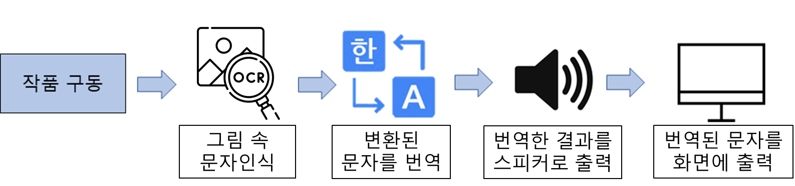

# 📱 문자인식 번역 앱

## 📌프로젝트 소개 및 소개 영상

- 앱을 통해 이미지 속 문자를 인식하여 한국어로 번역 후 읽어주는 앱

- 아무 배경색, 난잡한 그림 속에 있는 영어도 캐치하여 한국어로 번역 후 읽어준다

  

 

## 💡기획배경

- 영어 학습에 도움이되는 애플리케이션을 개발하고자 아이디어 고안

- 아이들에게 영어학습을 시키고자하는 부모, 영어를 많이 접하는 학생을 대상으로 앱제작

- 영어에 대한 자율학습 및 재미를 충족하는 애플리케이션 개발

 

## 💻 기술 스택 및 개발환경

- Android Studio
- Java
- Firebase (ML-kit)

- Naver API

 

## ✨ 예상 흐름도

- Firebase의 ML-kit(Machine Lerning kit)을 사용하여 이미지안의 텍스트를 인식
- 인식된 텍스트를 Translation API를 활용하여 영어를 한국어로 번역
- 번역된 한국어 텍스트를 Speech API를 이용해 사람의 음성으로 출력할수있게 구현

 
